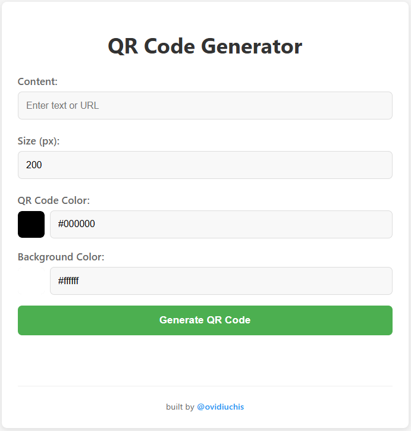
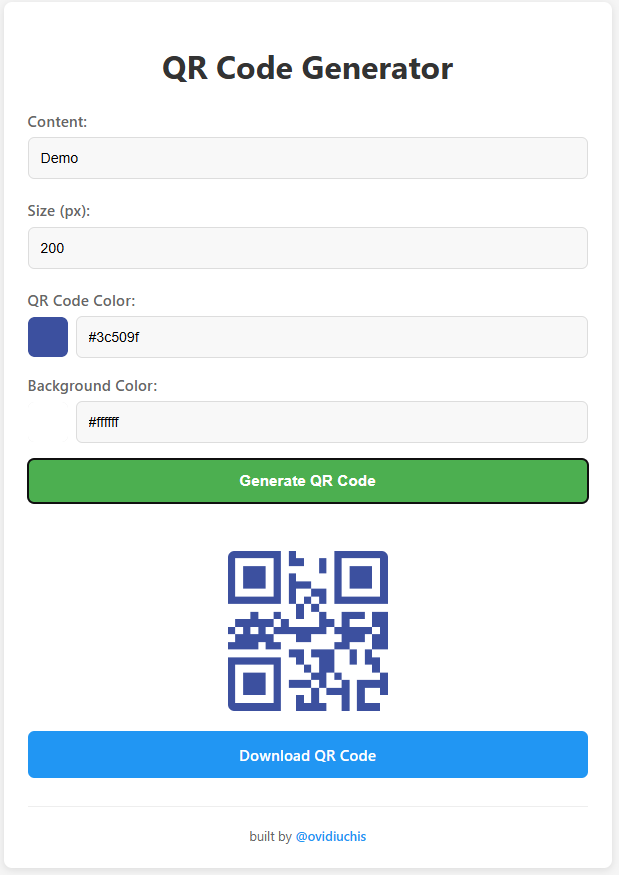

# 📷 QR Code Generator

A simple and lightweight QR Code generator built with HTML and JavaScript. It generates a QR code based on inputed data — no backend, no build step, just drop it in and go!

**[QR Codes](https://en.wikipedia.org/wiki/QR_code) are a smart way** of encoding and making data accessible, see <a href="https://github.com/zxing/zxing/wiki/Barcode-Contents" target="_blank">this wiki </a> for information about how to format data (like a contact card, map address and others). Some examples are featured bellow

---

## 🔗 Live Demo

👉 <a href="https://ovidiuchis.github.io/qrgenerator/" target="_blank">View Live</a>

---

## ⚙️ How It Works

Via UI elements you can input the text (or URL) and also other optional parameters (size and colors) to generate the image.

## 📸 Screenshots

### ✅ TODO

- [ ] UI for inputting different formats (wifi, vcard)
- [ ] Make the design more modern, sleek
